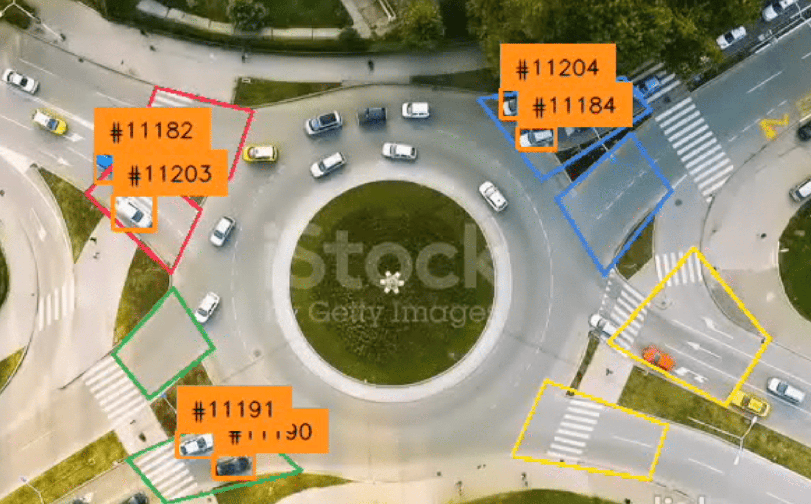
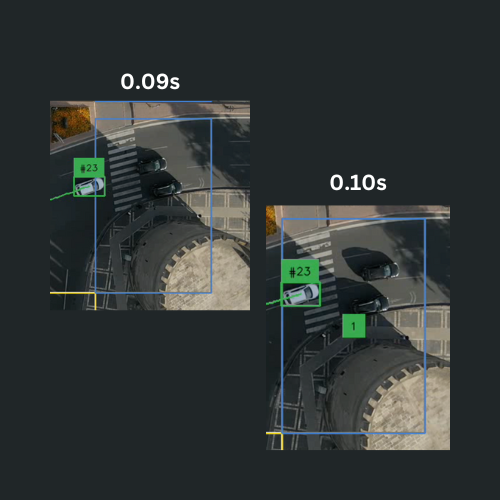
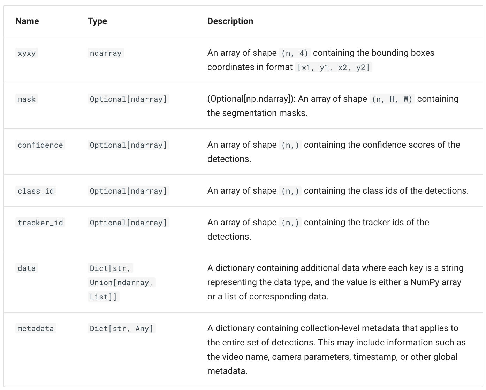

# Roundabout Traffic Flow Analysis with YoloV8 & ByteTrack

## [Background](https://www.canva.com/design/DAGU-tCi3T4/lNQZ0_T6UtiQyoghFMBkHg/view?utm_content=DAGU-tCi3T4&utm_campaign=designshare&utm_medium=link2&utm_source=uniquelinks&utlId=h05f8ed6ea5)

## Objectives

- The goal is to derive some traffic statistics from this analysis using ByteTrack & YoloV8.
- We want to discover:
  - Which vehicles came in through the specified in zones? Which is the busiest inZone? 
  - What's the class distribution?
  - Which vehicles moved from which inZone to which outZone? (for vehicle tracking purposes).
  - What is the busiest outZone? (could allow us to predict heavy traffic on the outZone road).
  - What is the in to out flow for each inZone? (allow us to see what route most drivers from this path use the roundabout for, give insight for alternative routing).




## Zone Initialization

- First we create the co-ordinates we need by physically marking the polygon on the frame using [zone_marker.py](../lib/zone_marker.py) 
- Zone initialization happens in the **initiate_polygon_zones** function. It takes a list of polygon coordinates as input and wraps each polygon in an sv.PolygonZone object.

> ```python
> self.zones_in = initiate_polygon_zones(ZONE_IN_POLYGONS, [sv.Position.CENTER])
> self.zones_out = initiate_polygon_zones(ZONE_OUT_POLYGONS, [sv.Position.CENTER])
> ```

- The PolygonZone class:
  - From the supervision library. 
  - Represents a polygon and provides utilities for detecting whether objects are inside it.
  - The triggering_anchors parameter specifies which part of the detected object's bounding box is checked for containment. 
  - Here, it's set to CENTER, meaning the center point of the bounding box detected must fall inside the polygon to trigger it.




## Object Detection

- Object Detection happens in the first part of the **process_frame** function within the **VideoProcessor** class.

### YOLO V8 & ByteTrack
> 
> ```python
> ## ... on VideoProcessor __init__
> self.model = YOLO(source_weights_path)
> self.tracker = sv.ByteTrack()
> ## ... in process_frame
> results = self.model(
>    frame, verbose=False, conf=self.conf_threshold, iou=self.iou_threshold
> )[0]
> detections = sv.Detections.from_ultralytics(results)
> detections = self.tracker.update_with_detections(detections)
> ```

- In the __init__ section of the VideoProcessor class, we initialize a YOLO (You Only Look Once) object detection model and a ByteTrack tracker instance from the [sv](https://supervision.roboflow.com/latest/detection/core/) library.
- **YOLO** is used for detecting objects in video frames. On initialisation, it takes in a PyTorch model file that contains trained weights provided by the Ultralytics team for [YOLO](https://docs.ultralytics.com/). The pre-trained weights serve as a starting point in training for faster and more efficient performance.
- **sv.ByteTrack()** initializes a ByteTrack tracker that processes YOLO detections and associates them across frames in a video, enabling object tracking. [ByteTrack](https://blog.roboflow.com/what-is-bytetrack-computer-vision/) uses many several algorithms to associate detections. An example is the _Kalman Filter_ that predicts the position of tracked objects in the next frame, improving its ability to match objects between frames. Another is the _Hungarian Algorithm_ which is used to assign detections to existing tracks based on a cost function, which evaluates how well a detection matches a track. The cost function considers IoU and the Distance between predicted and detected positions. If a detection cannot be matched to any existing track, a new track is created with a new tracker_id.

<br>

- In the process_frame function, we start by running the YOLO model on the input frame. The model takes these parameters:
  
| **Parameter**            | **Description**                                                                                          |
|---------------------------|----------------------------------------------------------------------------------------------------------|
| `frame`                  | The input image or frame on which object detection will be performed.                                     |
| `verbose=False`          | Suppresses verbose output from the model.                                                                |
| `conf=self.conf_threshold` | Sets the confidence threshold for detections (e.g., only objects detected with a confidence score above this value will be kept). |
| `iou=self.iou_threshold` | Sets the Intersection over Union (IoU) - _a score showing how much two boxes overlap (from 0 to 1)_ - threshold for Non-Maximum Suppression (NMS) - _a technique that removes the less confident box if two boxes overlap too much_. |

  
- The next step converts the results from the YOLO model to sv.Detections objects for for easier processing. A [supervision.Detections](https://supervision.roboflow.com/latest/detection/core/#supervision.detection.core.Detections) object is a container for detection data derrived from YoloV8.



- Example `sv.Detections` object:
  
> ```python
> detections = sv.Detections(
>    xyxy=np.array([
>        [50, 60, 200, 300],   # Bounding box 1 (x_min, y_min, x_max, y_max)
>        [300, 400, 450, 550]  # Bounding box 2
>    ]),
>    confidence=np.array([0.85, 0.75]),  # Confidence scores for each detection
>    class_id=np.array([0, 2]),          # Class IDs (e.g., 0 for 'person', 2 for 'car')
>    tracker_id=np.array([101, 102])     # Optional: Tracker IDs if assigned
> )
> ```


- Finally, we pass the detections to the ByteTracker instance which assigns each detection a unique tracker_id, which persists across frames, enabling object tracking.
  

### Zone Triggering
- In this section, we filter all the detections made to only those specific to the zones we defined earlier.

> 
> ```python
> for zone_in, zone_out in zip(self.zones_in, self.zones_out):
>    detections_in_zone = detections[zone_in.trigger(detections=detections)]
>    detections_in_zones.append(detections_in_zone)
>    detections_out_zone = detections[zone_out.trigger(detections=detections)]
>    detections_out_zones.append(detections_out_zone)
> ```

We break it down using the first two lines of the loop.

- **zone_in.trigger(detections=detections)**
  -  Takes all detections at once and checks if the triggering anchor (i.e. the center of the bounding box) for each detection is inside the polygon (zone_in).
  -  Returns a boolean mask, i.e. a NumPy array of True/False values, with each value corresponding to whether the center of a detection's bounding box is inside the polygon. 
  -  E.g for 5 detections, example output would be: [True, False, True, False, False].
-  **detections[zone_in.trigger(detections=detections)]**
   -  Returns a subset of the original detections, where the mask is True. From the above example, would return the 1st and 3rd detections.
   -  If all are false, it still returns a Detections object, just with empty tracker_id list
-  After the above line, the detections_in_zone is appended to a list (detections_in_zones), which collects the detections for all zone_in polygons in the frame. A sample:

> ```python
> detections_in_zones = [
>       Detections(tracker_id=[101, 102], ...),  # Detections in ZONE_IN_POLYGONS[0]
>       Detections(tracker_id=[], ...),     # No detections in ZONE_IN_POLYGONS[1]
>       Detections(tracker_id=[103], ...),    # Detections in ZONE_IN_POLYGONS[2]
>       Detections(tracker_id=[], ...),     # No detections in ZONE_IN_POLYGONS[3]
>   ]
> ```

- The same happens for zone_out detections.
- Next, we use the DetectionsManager class to analyse the detections for the insights we want.


## Detection Mgt.

- The DetectionsManager class helps us keep track of all the data we want to source from the traffic footage.

**PROPERTIES**
-  <u>tracker_id_to_zone_id</u>
   -  Maps each zone_in_id to a dictionary of tracker_id and its corresponding class_id. Used to track which tracker_id belongs to which class (class_id) in each "in zone".
   -  Example: 

> ```python
> # tracker_id_to_zone_id
> {
>    0: {101: 1, 102: 2},
>    1: {201: 0, 202: 1}
> }
> ```

Meaning: Two objects (IDs 101 of class 1 and 102 of class 2) moved in from ZONE_IN_POLYGONS[0] and two objects (ID 201 of class 0 ad 202 of class 1) moved in from ZONE_IN_POLYGONS[1].

-  <u>counts</u>
   -  Tracks how many objects (represented by tracker_ids) moved from one "in zone" to one "out zone." Used to track transitions between zones, helping analyze flow or movement patterns.
   -  Example:

> ```python
> # counts
> {
>    1: {0: {101, 102}, 2: {201}},
>    2: {1: {202, 203}}
> }
> ```

Meaning: Two objects (IDs 101 and 102) moved from ZONE_IN_POLYGONS[0] to ZONE_OUT_POLYGONS[1], and one object (ID 201) moved from ZONE_IN_POLYGONS[2] to ZONE_OUT_POLYGONS[1].
  
- These two variables are used to derive traffic insights in the Analysis section.
- The final part of the update function ensures that only detections with valid tracker_id mappings (i.e., those in the zones) are kept for further processing. It uses np.vectorize to map tracker_id to its associated zone_in_id:
  - If the tracker_id exists in zone_to_tracker_ids, it assigns the corresponding zone_in_id.
  - Otherwise, it assigns -1 (invalid ID).
  - Finally filters out detections with class_id = -1 (those that did not pass through any ZONE_IN_POLYGONS).
- The final output is a list of filtered sv.Detections object containing only valid detections.

## Frame Annotation
- In the **annotate_frame** function, for every frame and list of filtered detections received from **process_frame**, we do 5 key annotations:
  - Zone Annotation
    - Draws the zone polygons on the frame with their corresponding colours.  
  - Trace Annotator
    - Shows where each object has been (movement history).
    - It uses the historical positions of objects (tracked by their tracker_id) to draw a line or "trace" showing the path each object has taken across frames.
  - Box Annotator
    - Highlights the object’s current position with a bounding box.
  - Label Annotator
    - Displays custom_text (in this case the tracker_id) for each object, for  identification.
  - Zone Statistics
    - Shows the counts for how many objects transitioned from each entry zone to each exit zone, based on DetectionManager's counts property.


## Frame Processing
- The **sv.get_video_frames_generator** function creates a generator that yields individual frames from the input video. Total Frames=Video Duration (seconds)×FPS.
- The method supports two modes based on whether an output video path (self.target_video_path) is specified.
  - Save Processed Video to File: Handles writing processed frames to a video file
  - Display Processed Video in Real-Time: The processed frame is displayed in a window using OpenCV's cv2.imshow
  
- tqdm provides user feedback on processing progress, especially helpful for long videos.
